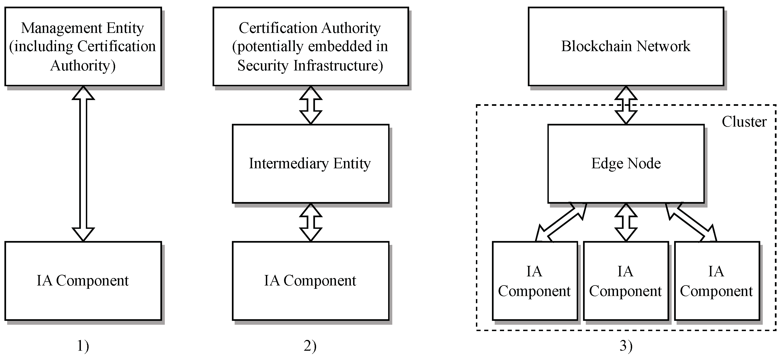

# A Survey on Life-Cycle-Oriented Certificate Management in Industrial Networking Environments

Reference: Goeppert J., Walz A., Sikora A. (2024) A Survey on Life-Cycle-Oriented Certificate Management in Industrial Networking Environments. *J. Sens. Actuator Netw. 13*(2), 26. [https://doi.org/10.3390/jsan13020026](https://doi.org/10.3390/jsan13020026)

In the past, OT and IT were strictly separated through hierarchical gateways. With the increasing demand for connectivity, the convergence of OT and IT is inevitable. This on one hand leads to an adoption of common Internet standards in OT networks but also to an increased attack surface OT networks are facing nowadays. A security measure to counteract these new threats is a *defense-in-depth* approach, which includes the need for cryptographic protection of industrial communications and devices. More precise, we need a way to guarantee integrity and authenticity of field devices, which leads to the requirements of certificates, a certificate-based mutually authenticated key agreement procedure, private keys and trust anchors in and for industrial end devices as well as secure management of these assets. The paper collects and elaborates different employed and proposed solutions stemming from reasearch, industrial protocols and protocols which stem from the IT-domain but find application in OT.

Some nomenclature:

- **End entity (EE):** Subject of the certificate management process (in our case, the field devices).

- **Certification authority (CA):** Entity that issues certificates and certification revocation information. CAs can have a hierarchical structure. The top-most CA (root CA) thus needs to utilize self-signed certificates. 

- **Registration Authority (RA):** Entity to which a CA delegates certain certificate management tasks (example tasks: authentication of EEs prior to certificate issuance by CA, archival of key pairs, revocation reporting)

## Certificate Management

We have different general concepts which describe how to equip an EE with certificates:

1. EE gets equipped with credentials at manufacturing time. At installation time, these credentials can be used to secure the integration of the device into the facility and the issuance of certificates.

1. Utilization of special protocols in order to equip EEs with certificates, without the need for pre-installed credentials.

1. Integration and/or adaptation of IT domain protocols to establish communication and security relation between CA and EEs. This enables the use of existing infrastructure for certificate management.

1. Pull architecture: EEs maintain a *Certificate Management Object* (CMO) that manages certificates. The CMO can also be managed by a commissioning application. The EE *pulls* the certificate from the CA.

1. Push architecture: We have a *Security Infrastructure Handler* (SIH) which can push certificates, private keys and trust anchors to system components. The EE itself can be allowed to generate private keys as well as posting *Certificate Signing Requests* (CSR) to the SIH. The SIH can be integrated into the CA or a dedicated entity.

## Entity Reference Architectures

The different approaches collected by the authors can be summarized to employing one of the following three entity reference architectures:

*Figure taken from Goeppert et al. (2024)*

1. We have a direct connection between field devices and the managing entity. This implies that both the EE and the managing entity provide common protocol mechanisms to manage certificates. Additionally, the managing entity must be able to issue trust anchors and certificates hence incorporating the functionallity of a CA. The managing entity can also be subdivided, for example into a CA that issues certifcates, a registration authority (RA) that verifies certificate management requests and a validation authority (VA) that validates certificates.

1. The second architecture involves and intermediary entity which acts as the direct communication partner for the EEs. For example, it can translate between protocols or execute required certificate management tasks like generating key pairs or imprinting signed certificates. With an architecture like this, the CA can be embedded into further security infrastructure, which might also contain an RA and/or VA. Furthermore, the CA and EE loose the need to implement a common protocol. Notice that the CMOs or SIHs mentioned before could fullfil the role of such intermediary entities.

1. The last architecture is cluster-based and uses blockchains. Multiple EEs dynamically form a cluster with one cluster head. The cluster heads act as CAs that participate in the blockchain network which shares information about the member nodes' behaviour. This member behaviour defines, whether or not a certificate gets issued. Alternatively, the EEs could also employ self-signed certificates and let local RAs validate the identity binding through the Ethereum blockchain, using it as a global notary of certificates.

## Certificate Management Functions

Certificate Management requires us to have capacities of interacting with the cryptographic artifacts on field devices. The following section details what functionality we require and different approaches on how to achieve it.

### Equipment with Trust Anchors

Almost all approaches utilize certificates as trust anchors. To implant the root certificate on the EE several approaches are taken:

- Equipping the EE with a root certificate as part of the security setup when booting from factory default state.

- Maintaining a list of trusted (CA) certificates on the intermediary entitiy (architecture 2 from before).

- Equip the EE during initialization with a copy of the relevant root CA public keys by out-of-band means.

- Some protocols provide mechanism to distribute trust anchor certificates in an authorized way.

### Equipment with Private Keys

In order to issue a certificate to a field device, it needs to have a public key which gets cryptographically bound to the identity information of the certificate. Hence, before issuing any certificate, we need to generate an asymmetric key pair. There are two ways of doing so:

- Internal generation and storage of key pair by the end entitiy, followed by sending a certificate signing request containing the public key to managing entity. The managing entity then returns a signed certificate to the EE.

- External entitity generates the key pair and sends it to EE, which stores and uses it.

### Equipment with Certificates

Again, we have different ways how an end entity can obtain the certificate itself:

- The end entity sends a certificate signing request to the CA or intermediary. The CA then issues a certificate which gets returned to the requesting entity. Some standards concretize this general approach by specifying certain parts of the process (for example, the form of the certificate signing request).

- Manual transportation on a storage medium (e.g. USB-stick)

- Publication in well-known public repository (e.g. LDAP)

- In-band distribution over specific protocol (e.g. TLS)

- Equipment of field device with private keys and signed certificates at manufacturing time. These artifacts must be recognizable for the device management entity. During integration into the network, the new entity only gets equipped with the site-specific certificates (e.g. TLS-inspecting proxy CA certificate).

- End devices generate self-signed certificates, which gets registered in the Ethereum blockchain, serving as global notary.

### Renewal of Certificates

Renewal of certificates is the same thing as initial equipment with certificates. However, renewal does not require any potentially time-consuming manual onboarding process as the later does. On the other hand, we need a way to know *when* to renew a certificate. Here, we again have multiple ideas:

- The device itself has/gets some information on the world time and knows when to demand a certificate renewal

- The managing entity oversees the validity of all certificates and triggers the renewal when necessary. When combining this with the blockchain architecture, one can also implement rules for certificate renewal. For example, only certificates of well behaving nodes get renewed or the validity period gets set proportional to the trust score of a device. 

Which entity should trigger the renewal of course also depends on the architecture. For example, if we have a push architecture, we expect the managing entity to set off the renewal process.

The ideas on how to renew the certificate are what one would expect. Some approaches reuse the equipment function while others use dedicated renewal functions and/or protocols. Furthermore, renewal of certificates can also include renewal of private keys and/or renewal of trust anchors.

### Removal of Certificate

A dedicated function to remove cryptographic artifacts from to be decomissioned device is of course necessary. However, in academia and in IT-domain based protocols, nearly no word is lost about it. In contrast to this, all industrial standards provide mechanisms to remove certificates, keys and trust anchors.

### Revocation of Certificates

When identity information of a device changes or when things go south, we might want to revoke a certificate before it expires. We can subdivide this process into two steps: First, the creation of the revocation request to CA (e.g. by intermediary entity) and second the distribution of the revocation information.

The most employed strategy is using certificate revocation lists (CRL) in combination with OCSP. However, as this is resource expensive, propositions of lightweight alternatives both to CRLs and to OCSP have been proposed. Alternative approaches:

- Have very short validity periods (requires time information on EEs) and don't renew revoked certificates.

- Revoke certificates by updating the smart contract record of the device in the Ethereum blockchain. 

- A CA periodically issues a signed and time-stamped CRL by using the same channels also used for certificate distribution.

## Involvement of Different Stakeholders

We have two main stakeholders involved in the certificate management process: Manufacturers and operators. General idea is again that both need to maintain their own PKIs for the following reasons:

If we have manufacturer certificate on the device, we get

- Secure initial authentication before we ship certificates, trust anchors and keys to device.
- Protection against product privacy

Alternatively, we can have self-signed certificates which makes the manufacturer PKI obsolete. However, self-signed certificates can easily be spoofed, as the attack can generate the certificate himself.

The operator needs a PKI in order to

- Issue operator-specific certificates, used to enforce trust relations and access control
- Can generate signed *tickets* describing the equipment when transfering the device. These tickets can be used to verify the origin of a device. Can of course also be employed by the manufacturer.

We want to point out that BRSKI utilizes these ideas to provide high initialization security: New devices come with an IDevID, installed during manufacturing. The owner can then get identified in advance (in strongest mode only). When the device gets initialized by the operator, the control over the device gets transfered from manufacturer to device owner. Resale is possible if the manufacturer authorizes it. We want to point out that this approach, while providing high initialization security, also establishes a strong dependency on the manufacturer.

Lastly, none of the investigated standards have a mechanism which allows the device to authenticate the network they are connecting to. All mechanisms are based on *Trust on First Use* (TOFU).

## Product Life Cycle Stages

### Manufacturing

- Utilization of manufacturer-issued and imprinted certificates to authenticate the device
- Authenticating party needs to possess the trust anchor of the manufacturer's certificate

### Onboarding

This stage starts with a device in its factory default state and ends when the device is equipped with all necessary cryptographic artefacts from the operator's domain. The paper describes different ways on how to utilize the imprinted or self-signed certificate to initially authorize the device when connecting it to the network. Verififaction and registration of the devices identity is based on these vendor certificates, followed by supplying the device with the owner certificates, private keys and trust anchors. The methods on how to equip the EE with these cryptographic artifacts have already been discussed above.

### Operation

The operational phase mainly is concerned with renewal of cryptographic artifacts. As mentioned before, the methods on how to do so have already been discussed. 

### Decommissioning

During decommissioning, the goal is to remove all these cryptographic artifacts in order to dispose, discard or sell the device. Here, the general notion is that when resetting a device to factory settings, we remove these artifacts. However, we might have different "hardnesses" of reset, meaning that we for example keep the trust anchors or the manufacturer certificates when resetting.

 